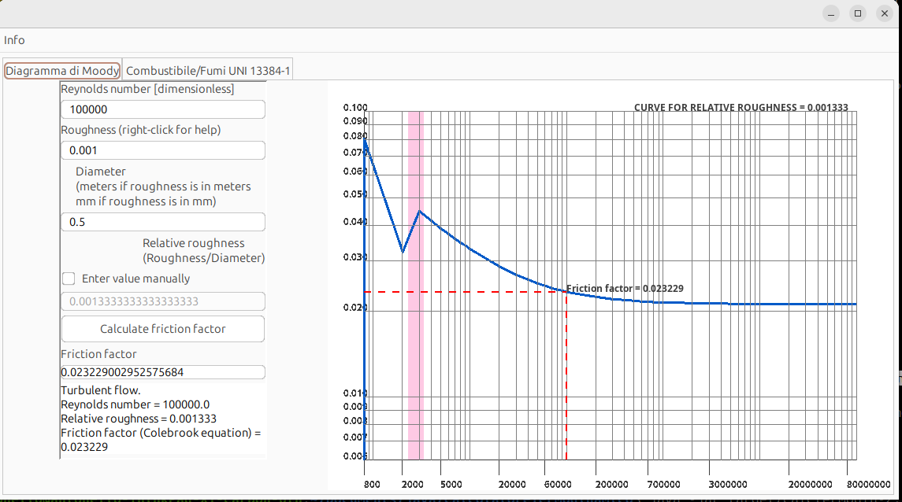

# OpenThermoFluids  
## Open Source Engineering Toolkit for Fluid Mechanics & Combustion Calculations  

[](LICENSE)


---
##  Documentation

- [GuiGuideda](docs/index.md)

# 🌍 Overview

**OpenThermoFluids** is an open-source engineering software toolkit designed for:

- Fluid mechanics calculations  
- Moody diagram friction factor evaluation  
- Combustion and flue gas analysis  
- Chimney draft calculation (UNI EN 13384-1)  

The project aims to build a **transparent, reproducible, professional-grade engineering platform** under the MIT License.

Target users:

- Mechanical engineers  
- HVAC designers  
- Energy engineers  
- Researchers  
- Engineering students  

---

# 🏗 Architecture

## 🔹 Java Core (`/java`)

- Java 8+
- Swing GUI
- Numerical solvers (Brent method)
- Colebrook-White equation implementation
- UNI EN 13384-1 combustion model
- Modular and extendable structure

## 🔹 Web Interface (`/web`)

- JavaScript (ES Modules)
- Chart.js log-log Moody diagram
- Interactive friction factor calculator
- Transition band visualization (Re 2300–3400)
- Projection lines to axes
- Engineering-oriented graphical rendering

Future direction:

- Full separation of calculation core
- REST API layer
- CLI version
- Full web computation engine
- Cloud-ready deployment


# 📘 Modules

---

# 1️⃣ Moody Diagram – Friction Factor Calculator

Available in:

- Java Desktop version  
- Web version (interactive log-log diagram)

### 🔬 Purpose

Calculates the **Darcy-Weisbach friction factor** using:

- Laminar flow equation (f = 64/Re)
- Transitional interpolation
- Turbulent regime via Colebrook-White equation
- Brent numerical solver (Java core)

### 📐 Features

- Automatic regime detection
- Relative roughness support
- Logarithmic axes
- Transition band highlighting (Re 2300–3400)
- Interactive point projection to axes
- Engineering-stable numerical implementation

### 🧮 Flow Regimes

| Reynolds Number | Regime |
|----------------|--------|
| Re < 2300      | Laminar |
| 2300 – 3400    | Transitional |
| Re > 3400      | Turbulent |

### 📊 Applications

- Pipe flow design
- Pressure drop calculations
- Hydraulic networks
- Oil & gas pipelines
- Water distribution systems

---

# 2️⃣ Boiler Combustion & Chimney Module  
### UNI EN 13384-1 Implementation (Java)

### 🔥 Purpose

Performs thermophysical and combustion calculations for flue gases according to:

**UNI EN 13384-1 – Chimneys – Thermal and fluid dynamic calculation methods**

### 📥 Inputs

- Fuel type  
- Boiler thermal power  
- Flue gas temperature  
- Efficiency  
- CO₂ percentage  
- Burner type (natural / forced air)

### 📤 Outputs

- Flue gas mass flow  
- Specific heat capacity  
- Water vapor content  
- Dew point temperature  
- Partial pressures  
- Thermal conductivity  
- Dynamic viscosity  
- Minimum chimney draft  

---

### 🖥 Screenshot




### Keywords (SEO)

Moody Diagram, Colebrook Equation, Darcy Friction Factor, Fluid Mechanics Software, Pipe Flow Calculator, Hydraulic Engineering Tool

---

# 2️⃣ Boiler Combustion & Chimney Module  
### (UNI EN 13384-1 Implementation)

### 🔥 Purpose

This module calculates **thermophysical and combustion parameters of flue gases** according to:

UNI EN 13384-1 – Chimneys – Thermal and fluid dynamic calculation methods.

It models:

- Boiler combustion
- Flue gas composition
- Dew point temperature
- Minimum chimney draft
- Water vapor condensation conditions

---

## 📥 Inputs

- Fuel type
- Boiler thermal power
- Flue gas temperature
- Optional:
  - Flue gas mass flow
  - Efficiency
  - CO2 percentage
- Burner type:
  - Natural air
  - Forced air

---

## 📤 Outputs

- Flue gas mass flow [g/s]
- Specific heat capacity
- Water vapor content
- Partial pressure of water vapor
- Dew point temperature
- Dew point temperature increase
- Thermal conductivity
- Dynamic viscosity
- Gas constant
- Minimum required chimney draft
- Partial pressure at dew point

---


## Calculation Flow

1. **User Input**
2. **Input Validation**
3. **Boiler Model Computation (Gener)**
4. **Combustion Properties Evaluation (Comb_2)**
5. **Thermodynamic Processing**
6. **GUI Output Rendering**

---

## 📚 Engineering Context

This module is suitable for:

- Chimney sizing
- Condensation risk evaluation
- Boiler efficiency diagnostics
- Flue gas analysis
- HVAC system design
- Energy system simulations

### Keywords (SEO)

Combustion Calculation Software, Chimney Draft Calculator, UNI EN 13384, Flue Gas Analysis, HVAC Engineering Tool, Boiler Simulation, Thermophysical Properties Calculator

---

# 📂 Project Structure
```bash

OpenThermoFluids/
│
├── java/        → Core calculation engine + Swing GUI
├── web/         → Web-based interface (Moody Diagram)
├── docs/        → Documentation & screenshots
└── README.md
```
# 🏗Architecture
🔹 Java Core (/java)

Java 8+

Swing GUI

Numerical solvers (Brent method)

Colebrook-White equation

UNI EN 13384-1 combustion implementation

Modular and extendable design

🔹 Web Interface (/web)

JavaScript (ES Modules)

Chart.js-based log-log Moody diagram

Interactive friction factor calculator

Transition band visualization (Re 2300–3400)

Projection lines to axes

Engineering-oriented graphical rendering

Future direction:

Full separation of calculation core

REST API layer

CLI version

Full web computation engine

Cloud-ready deployment

---

# 📦 Installation

## Java Version

Requirements:

- Java 8+

Clone repository:

```bash
git clone https://github.com/your-username/OpenThermoFluids.git
```
## 💻 Java Version

You can run the Java version using an IDE or via Maven.

### ▶ Option 1 — Using an IDE

Open the `/java` folder in your preferred IDE:

- IntelliJ IDEA  
- Eclipse  
- NetBeans  

Make sure you are using **Java 8 or higher**.

---

### ▶ Option 2 — Using Maven (CLI)

Navigate to the `/java` directory:

```bash
cd java
```

Compile the project:
```bash
mvn clean compile
```
Run the application:
```bash
mvn exec:java
```
If an exec plugin is configured in pom.xml, this will start the main application.
📦 Build JAR

To generate a packaged JAR:
```bash
mvn clean package
```
The compiled artifact will be available inside:

/java/target/

You can then run it with:
```bash
java -jar target/your-artifact-name.jar
```

---


## 🌐 Web Version

Navigate to the `/web` directory:

```bash
cd web
```

Run a local server (example using Python):

```bash
python -m http.server 8000
```

Then open your browser at:

http://localhost:8000

Alternatively, you can use VS Code Live Server.

---

# 🎯 Vision

The goal of this project is to build a:

> Free, transparent, open engineering calculation platform  
> Accessible worldwide  
> Reproducible and verifiable  
> Educational and professional  

We believe engineering tools should be:

- Open
- Inspectable
- Modifiable
- Trustworthy

---

# 🤝 Contributing

Contributions are welcome.

You can:

- Improve numerical methods
- Refactor architecture
- Add unit tests
- Implement additional standards
- Create documentation
- Develop UI improvements
- Translate to other languages

---

# 📄 License

MIT License

This project is released under the MIT License.  
You are free to use, modify, distribute, and integrate it into commercial software.

---

# 🌎 Why Open Source Engineering Software?

Many engineering tools are:

- Expensive
- Closed source
- Not reproducible
- Opaque in calculation methods

OpenThermoFluids aims to change this.

Transparent formulas.  
Documented standards.  
Professional numerical methods.  
Free global access.

---

# 🚀 Roadmap

- Separate GUI from calculation core
- Add automated test suite
- Add unit system selection (SI / Imperial)
- Add multi-language support
- Create web interface
- Publish technical blog documentation
- Build community around open engineering computation

---

# ⭐ Support the Project

If you find this project useful:

- Star the repository
- Share it
- Contribute
- Write about it
- Use it in research or education

---

## Engineering should be open.
## Knowledge should be shared.
## Tools should be accessible.
